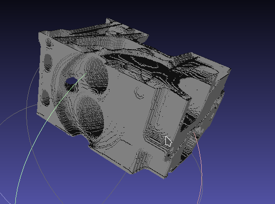
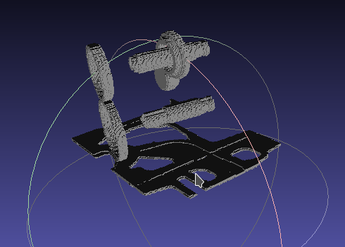
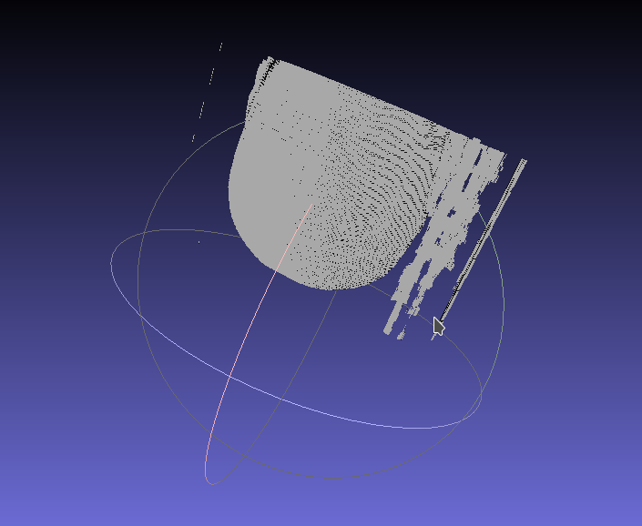

`(TOC)`


# Visualisation Volumique (Odorico Thibault)

### Images


#### Engine 100



#### Engine 200



#### Manix 900



### Code

```c++
#include <iostream>
#include <fstream>
#include <vector>
#include <limits>
#include <algorithm>
#include "Point3.h"

using namespace std;

// Definition des structures

typedef unsigned short PIXEL;
typedef vector<PIXEL> IMAGE_2D;
typedef vector<IMAGE_2D> IMAGE_3D;

// Creation d'une image 2D a partir d'un flux d'entrée

std::istream& read(std::istream& is, IMAGE_2D& image2d, int dim_x, int dim_y)
{
	image2d.resize(dim_x * dim_y);

	for (PIXEL& p : image2d)
	{
		unsigned char bytes[2];
		is.read((char*)bytes, sizeof(bytes)); // lecture de 2 octets
		p = (bytes[0] << 8 | bytes[1]); // conversion en unsigned short
	}

	return is;
}

// Creation d'une image 3D a partir d'un flux d'entrée

std::istream& read(std::istream& is, IMAGE_3D& image3d, int dim_x, int dim_y, int dim_z)
{
	image3d.resize(dim_z);

	for (IMAGE_2D& image2d : image3d)
		read(is, image2d, dim_x, dim_y);

	return is;
}

// Ecriture d'une image 2D dans un flux de sortie

std::ostream& write(std::ostream& os, const IMAGE_2D& image2d)
{
	for (const PIXEL& p : image2d)
		os.write((char*)&p, sizeof(p));

	return os;
}

// Ecriture d'une image 3D dans un flux de sortie

std::ostream& write(std::ostream& os, const IMAGE_3D& image3d)
{
	for (const IMAGE_2D& image2d : image3d)
		write(os, image2d);

	return os;
}

// Accesseur au pixel de l'image 2d

PIXEL pixel(const IMAGE_2D& image2d, int i, int j, int dim_x, int dim_y)
{
	// on utillise ((dim_y - 1) - j) car les pixel de chaque ligne sont sauvegardé à l'inverse du sens lu. 
	return image2d[((dim_y - 1) - j) * dim_x + i];
}

// Accesseur au voxel de l'image 3d

PIXEL voxel(const IMAGE_3D& image3d, int i, int j, int k, int dim_x, int dim_y)
{
	return pixel(image3d[k], i, j, dim_x, dim_y);
}

struct Triangle 
{
	Point3 a, b, c;

	Triangle() : a(), b(), c() {};
	Triangle(Point3 a, Point3 b, Point3 c) : a(a), b(b), c(c) {};
};

vector<Triangle> neighbors_faces(const IMAGE_3D& image3d, PIXEL seuil, size_t x, size_t y, size_t z, double size_vox_x, double size_vox_y, double size_vox_z, size_t dim_x, size_t dim_y)
{
	double right = (x + 0.5) * size_vox_x;
	double left = (x - 0.5) * size_vox_x;
	
	double bottom = (y + 0.5) * size_vox_y;
	double top = (y - 0.5) * size_vox_y;

	double forward = (z + 0.5) * size_vox_z;
	double backward = (z - 0.5) * size_vox_z;

/*
	cerr << "(x, y, z) : " << x << ", " << y << ", " << z << "\n";
	cerr << "right : " << right << "\n";
	cerr << "right : " << right << "\n";
	cerr << "left : " << left << "\n";
	cerr << "bottom : " << bottom << "\n";
	cerr << "top : " << top << "\n";
	cerr << "forward : " << forward << "\n";
	cerr << "backward : " << backward << "\n";
*/

	vector<Triangle> triangles;

	int x_offset = x;
	int y_offset = y;
	int z_offset = z - 1;

	if (voxel(image3d, x_offset, y_offset, z_offset, dim_x, dim_y) < seuil)
	{
		// Triangle 1

		triangles.push_back(Triangle(
			{left, top, backward},
			{right, top, backward},
			{left, bottom, backward}
		));
		
		// Triangle 2
		
		triangles.push_back(Triangle(
			{right, bottom, backward},
			{left, bottom, backward},
			{right, top, backward}
		));
	}

	x_offset = x;
	y_offset = y;
	z_offset = z + 1;

	if (voxel(image3d, x_offset, y_offset, z_offset, dim_x, dim_y) < seuil)
	{
		// Triangle 1
		
		triangles.push_back(Triangle(
			{left, top, forward},
			{right, top, forward},
			{left, bottom, forward}
		));
		
		// Triangle 2
		
		triangles.push_back(Triangle(
			{right, bottom, forward},
			{left, bottom, forward},
			{right, top, forward}
		));
	}

	x_offset = x;
	y_offset = y - 1;
	z_offset = z;

	if (voxel(image3d, x_offset, y_offset, z_offset, dim_x, dim_y) < seuil)
	{
		// Triangle 1
		
		triangles.push_back(Triangle(
			{left, top, backward},
			{right, top, backward},
			{left, top, forward}
		));

		// Triangle 2
		 
		triangles.push_back(Triangle(
			{right, top, forward},
			{left, top, forward},
			{right, top, backward}
		));
	}

	x_offset = x;
	y_offset = y + 1;
	z_offset = z;

	if (voxel(image3d, x_offset, y_offset, z_offset, dim_x, dim_y) < seuil)
	{
		// Triangle 1
		
		triangles.push_back(Triangle(
			{left, bottom, backward},
			{right, bottom, backward},
			{left, bottom, forward}
		));

		// Triangle 2
		 
		triangles.push_back(Triangle(
			{right, bottom, forward},
			{left, bottom, forward},
			{right, bottom, backward}
		));
	}

	x_offset = x - 1;
	y_offset = y;
	z_offset = z;

	if (voxel(image3d, x_offset, y_offset, z_offset, dim_x, dim_y) < seuil)
	{
		// Triangle 1
		
		triangles.push_back(Triangle(
			{left, top, forward},
			{left, top, backward},
			{left, bottom, forward}
		));

		// Triangle 2
		
		triangles.push_back(Triangle(
			{left, bottom, backward},
			{left, bottom, forward},
			{left, top, backward}
		));
	}

	x_offset = x + 1;
	y_offset = y;
	z_offset = z;

	if (voxel(image3d, x_offset, y_offset, z_offset, dim_x, dim_y) < seuil)
	{
		// Triangle 1
		
		triangles.push_back(Triangle(
			{right, top, forward},
			{right, top, backward},
			{right, bottom, forward}
		));

		// Triangle 2
		
		triangles.push_back(Triangle(
			{right, bottom, backward},
			{right, bottom, forward},
			{right, top, backward}
		));
	}

	return std::move(triangles);
}

// Ecriture des triangles en STL

std::ostream& write(std::ostream& os, vector<Triangle>& triangles)
{
	for (Triangle& triangle : triangles)
	{
		os << "facet normal 0 0 0\n";
		os << "outer loop\n";
		os << "vertex " << triangle.a.x << " " << triangle.a.y << " " << triangle.a.z << "\n";
		os << "vertex " << triangle.b.x << " " << triangle.b.y << " " << triangle.b.z << "\n";
		os << "vertex " << triangle.c.x << " " << triangle.c.y << " " << triangle.c.z << "\n";
		os << "endloop\n";
		os << "endfacet\n";
	}

	return os;
}

void iso_surface(const IMAGE_3D& image3d, PIXEL seuil, size_t dim_x, size_t dim_y, size_t dim_z, double size_vox_x, double size_vox_y, double size_vox_z)
{
	cout << "solid image3d\n";

	for (size_t z = 1 ; z < (dim_z - 1) ; ++z)
	{
		for (size_t y = 1 ; y < (dim_y - 1) ; ++y)
		{
			for (size_t x = 1 ; x < (dim_x - 1) ; ++x)
			{
				if (voxel(image3d, x, y, z, dim_x, dim_y) >= seuil)
				{
					vector<Triangle> faces;

					faces = neighbors_faces(image3d, seuil, x, y, z, size_vox_x, size_vox_y, size_vox_z, dim_x, dim_y);
					
					write(cout, faces);
				}
			}
		}
	}
	
	cout << "endsolid image3d\n";
}

int main(int argc, char** argv)
{
	if (argc < 5)
	{
		cerr << "Usage : " << argv[0] << " <image_file> <dim_x> <dim_y> <dim_z> <size_vox_x> <size_vox_y> <size_vox_z> <seuil>\n";
		exit(EXIT_FAILURE);
	}

	ifstream image_file(argv[1], std::ios::binary);

	if (!image_file.is_open())
	{
		cerr << "Erreur à l'ouverture du fichier\n";
		exit(EXIT_FAILURE);
	}
	
	int dim_x = atoi(argv[2]);
	int dim_y = atoi(argv[3]);
	int dim_z = atoi(argv[4]);

	double size_vox_x = atof(argv[5]);
	double size_vox_y = atof(argv[6]);
	double size_vox_z = atof(argv[7]);

	int seuil = atoi(argv[8]);

	IMAGE_3D image3d;

	cerr << "image_file : " << argv[1] << "\n";
	cerr << "dim_x : " << dim_x << "\n";
	cerr << "dim_y : " << dim_y << "\n";
	cerr << "dim_z : " << dim_z << "\n";
	cerr << "size_vox_x : " << size_vox_x << "\n";
	cerr << "size_vox_y : " << size_vox_y << "\n";
	cerr << "size_vox_z : " << size_vox_z << "\n";
	cerr << "seuil : " << seuil << "\n\n";

	cerr << "lecture de l'image 3D...\n";

	read(image_file, image3d, dim_x, dim_y, dim_z);

	cerr << "Creation de l'iso_surface...\n";

	iso_surface(image3d, seuil, dim_x, dim_y, dim_z, size_vox_x, size_vox_y, size_vox_z);

	return 0;
}
```