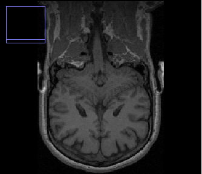
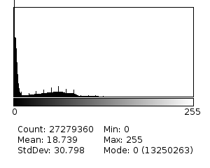
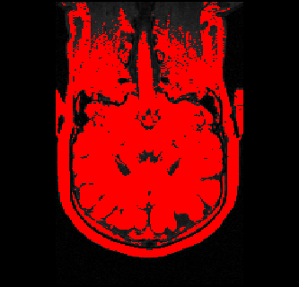
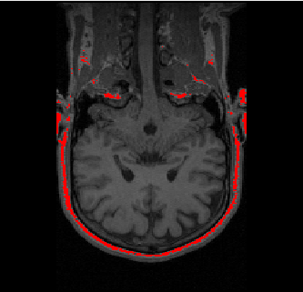

## 	HMIN318 - Compte Rendu du TP1

Réalisé par <bold>Odorico Thibault</bold>

## Tables des matières

[TOC]

## Image de référence

|  |  |
| ------------------------------------------------------------ | ------------------------------------------------------------ |
|                                                              |                                                              |

L'histogramme de l'image 3D MR_head.Coronal nous montre que les couleurs de faibles intensités ont une forte occurrence. Cela est notamment dû au faite que le noir représentent les objets les moins denses correspondant ici à l’extérieur du crane.

## Seuillage

La méthode d'Otsu peut être utilisé dans pour déterminé une seuil de manière automatique en traitement d'image. Cette méthode permet de trouver un seuil séparant bien l'arrière et l'avant plan d'une image en scrutant les variation d'intensité entre les objets de l'image.

- Seuillage avec la méthode d'Otsu (Permet bien de séparer le l'arrière plan du reste de l'image)

Donne un seuil de 43-255

- Seuillage manuel pour dissocier le cerveau du reste

  

Donne un seuil de 70-100

- Seuillage manuel pour dissocier la matière blanche du reste

Donne un seuil de 100-255

## Segmentation du cerveau

### Algorithme

1. Seuillage de l'image avec l'algorithme d'Otsu pour en récupérer la composante principale
2. Érosion de l'image pour séparer le cerveau du reste
3. Extraction de la plus grosse composante connecté (le cerveau)
4. Dilatation de l'image pour compensé l'érosion précédemment exécuté

