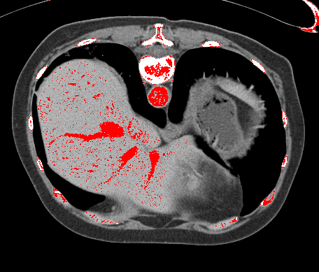
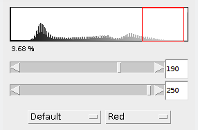
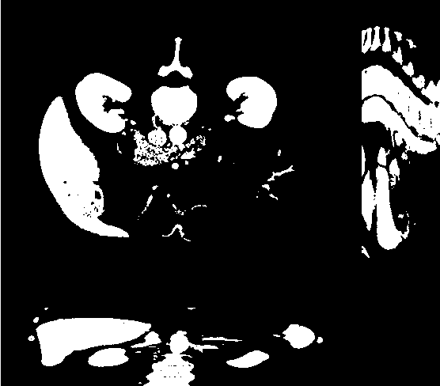

# HMIN318M - Compte Rendu du TP3

Ce TP à été réalisé par **Odorico Thibault** & **Isnel Maxime**

## Tables des matières

[TOC]

## Segmentation manuelle

Un seuil manuel de 180-250 à l'aide de Fiji permet de mettre en évidence le réseaux vasculaires de notre images 3D de manière plutôt efficace. On remarque toutefois que la segmentation est loin d'être parfaite des zones qui ne font pas parties des réseaux vasculaires ressortent également comme quelques os par exemples.

| Image Seuillé                                                | Seuil Histogramme                                            |
| ------------------------------------------------------------ | ------------------------------------------------------------ |
|  |  |

Il est difficile de faire mieux avec cette méthode manuel car en prenant un seuil inférieur on rajoute du bruit dans l'image et en prenant un seuil supérieure on ajoute des os à la segmentation ce qui n'est pas idéal.

## Algorithme de Segmentation

1. Un réduit les bruit dans l'image avec un **Gaussian median filter** 
2. On sépare avec l'arrière-plan **Laplace-like filter** 
   1. Il doit être plus épais que le plus gros des vaisseaux  (taille du filtre par défaut 15x15)
   2. On applique le filtre sur un intervalle de valeurs (Min : valeur de gris moyenne du foie, max :  la couleur la plus claire dans le foie)
3. On récupère l'intensité $ \theta_{beg} $ du voxel de la veine porte grâce à un click de l'utilisateur.
   1. On récupère dans les 26 voxels voisins ceux qui ont un intensité $ \geq \theta_{beg} $ et On les mets dans une liste $ L $
   2. On récupère dans les voisins de chaque voxels de $ L $ ceux qui ont une intensité $ \geq \theta_{beg} - 1 $
   3. Et cela jusqu’à ce que $ \theta_{beg} = \theta_{end} $

## Implementation de l'algorithme

```c++
#include "pch.h"

using namespace std;
using namespace cimg_library;

using vec3  = std::array<int, 3>;
using vec3f = std::array<float, 3>;

std::string input_image_name = "";
int region_tolerance = 0;
vec3 image_dimensions = {0, 0, 0};
vec3f voxel_size = {0, 0, 0};


int clamp(int value, int min, int max)
{
	return value < min ? min : value > max ? max : value;
}

CImg<> get_below_intensity(const CImg<>& image, float intensity)
{	
	CImg<> below = image;

	for(auto& vox : below)
	{
		if(vox < intensity)
		{
			vox = 0;
		}
	}

	return std::move(below);
}

CImg<> get_voxel_region(CImg<>& image, const vec3& voxel, float tolerance)
{
	CImg<> region;
	unsigned char color[] = {255, 0, 0};

	image.draw_fill(voxel[0], voxel[1], voxel[2], color, 1.0f, region, tolerance);

	return std::move(region);
}

int get_voxel_count(const CImg<>& region)
{    
    int count = 0;
	
	for(auto& vox : region)
	{
		if(vox != 0)
		{
			count++;
		}
	}

    return count;
}

CImg<> create_graph(CImg<>& img, const vec3& voxel, int graph_size)
{    
    CImg<> graph_img(1,graph_size,1,1,0);
    CImg<> tmp;
    
    for(int i=0; i<graph_img.height(); i++)
    {
        tmp = get_voxel_region(img, voxel, i);
        graph_img(0,i) = get_voxel_count(tmp);
    }

    return graph_img;
}

int get_max(const CImg<>& img)
{
	int max = 0;

    for(int i = 0; i < img.height(); i++)
    {
        if(img[i] > max)
        {
            max = img[i];
        }
    }

    return max;
}

int main(int argc,char **argv)
{
	if(argc < 2)
	{
		cerr << "Usage : " << argv[0] << " <image_in.hdr> <region_tolerance>\n";
		exit(EXIT_FAILURE);
	}


	input_image_name = argv[1];

	if(argc > 2)
	{
		region_tolerance = atoi(argv[2]);
	}

	cerr << "Lecture de l'image...\n";
	CImg<> image_in;
	image_in.load_analyze(argv[1], voxel_size.data());
	image_dimensions = {image_in.width(), image_in.height(), image_in.depth()};

	// cerr << "Dimensions(" << argv[1] << ") = " << image_dimensions[0] << ", " << image_dimensions[1] << ", " << image_dimensions[2] << ")\n";
	// cerr << "Voxel_size(" << argv[1] << ") = " << voxel_size[0] << ", " << voxel_size[1] << ", "<< voxel_size[2] << ")\n";

	cerr << "Creation de l'affichage...\n";
	CImgDisplay image_window(image_in, "Vessels segmentation");
    CImg<> visu(500, 400, 1, 3, 0);

	cerr << "Application du filtre median avec " << 2 << " iterations...\n";
	image_in.blur_median(2);

	cerr << "Copy de l'image de base...\n";
	CImg<float> image_out = image_in;


	vec3 displayed_slice = {image_in.width()/2, image_in.height()/2, image_in.depth()/2}; 
		
	/* Slice corresponding to mouse position: */
	vec3 coord = {0, 0, 0};

	/* The display image_window corresponds to a MPR view which is decomposed into the following 4 quadrants: 
	2 = original slice size=x y        0 size = z y
	1 = size = x z                    -1 corresponds to the 4th quarter where there is nothing displayed */
	int plane = 2;
	
	/* For a first drawing, activate the redrawing flag */
	bool redraw = true;

	while(!image_window.is_closed() && !image_window.is_keyESC()) // Main loop
	{
		// Reset l'image
		if(image_window.is_key('r'))
		{
			image_out = image_in;
		}
		// Sauvegarde l'image
		if(image_window.is_key('s'))
		{
			image_out.save_analyze("seg_vessels.hdr", voxel_size.data());
		}
		
		// Mouse left
		if((image_window.button() & 1) && (plane != -1))
		{
			vec3 vox_pos = {coord[0], coord[1], coord[2]};
			float vox_intensity = image_out(coord[0], coord[1], coord[2]);
			
			CImg<> region;

			region = get_below_intensity(image_out, vox_intensity);
			
			region = get_voxel_region(image_out, vox_pos, region_tolerance);

            // nombre d'éléments du graph
            int graph_size = 100;

            cerr << "Calcul de la meilleure région...\n";

            // Calcules des régions
            CImg<> graph = create_graph(image_out, vox_pos, graph_size);

            CImgDisplay graph_display(visu, "Graph");

            // Construit le graphe avec la tolerance en abscisse et le nombre de voxels par region en ordonnee
            graph.display_graph(graph_display, 2, 1, "Tolerance", 0, graph_size, "Amount", 0, get_max(graph), true);
        
            while(!graph_display.is_closed())
            {
                if(graph_display.is_key('t'))
                {
                	//prend la valeur du graphe
                    region_tolerance = graph_display.mouse_x() * (graph_size / (float)graph_display.width());
                    graph_display.close();
                }
            }

            region = get_voxel_region(image_out, vox_pos, region_tolerance);
			image_out = region;	
		}

		// Mouse right
		if((image_window.button() & 2) && (plane != -1))  
		{
			for(unsigned int i = 0; i < 3; i++) 
			{
				displayed_slice[i]=coord[i];
			}
			redraw = true;
		}

		// Gère le défilement des projections de l'image 3D
		if(image_window.mouse_x()>=0 && image_window.mouse_y()>=0) 
		{
			unsigned int mX = image_window.mouse_x()*(image_dimensions[0]+image_dimensions[2])/image_window.width();
			unsigned int mY = image_window.mouse_y()*(image_dimensions[1]+image_dimensions[2])/image_window.height();
			
			if (mX>=image_dimensions[0] && mY<image_dimensions[1]) 
			{ 
				plane = 0; 
				coord[1] = mY; 
				coord[2] = mX - image_dimensions[0];   
				coord[0] = displayed_slice[0]; 
			}
			else 
			{
				if (mX<image_dimensions[0] && mY>=image_dimensions[1]) 
				{ 
					plane = 1; 
					coord[0] = mX; 
					coord[2] = mY - image_dimensions[1];   
					coord[1] = displayed_slice[1]; 
				}
				else 
				{
					if (mX<image_dimensions[0] && mY<image_dimensions[1])       
					{ 
						plane = 2; 
						coord[0] = mX; 
						coord[1] = mY;     
						coord[2] = displayed_slice[2]; 
					}
					else 
					{
						plane = -1; 
						coord[0] = 0;
						coord[1] = 0;
						coord[2] = 0;
					}
				}
			}
			redraw = true;
		}

		if(image_window.wheel()) 
		{
			displayed_slice[plane] = displayed_slice[plane] + image_window.wheel();

			if(displayed_slice[plane] < 0) 
			{
				displayed_slice[plane] = 0;
			}
			else 
			{
				if(displayed_slice[plane] >= image_dimensions[plane])
				{
					displayed_slice[plane] = image_dimensions[plane] - 1;
				}
			}
			
			image_window.set_wheel();
			redraw = true;
		}
		
		if(redraw)
		{
			image_window.display(image_out.get_projections2d(displayed_slice[0], displayed_slice[1], displayed_slice[2]));
			redraw=false;
		}
	}

	return 0;
}
```

## Résultat du seuillage

