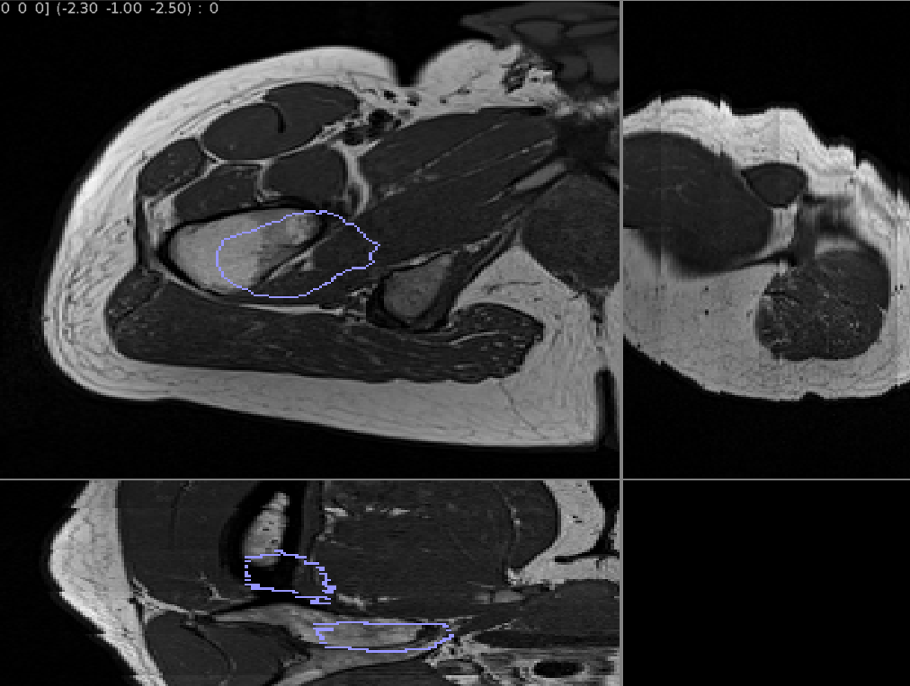
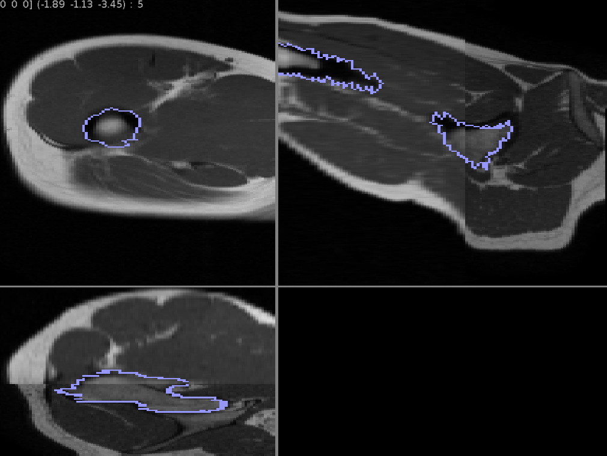
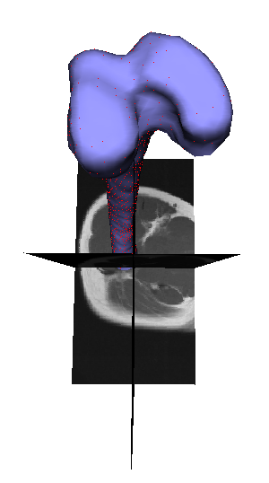

# TP3 - Recalage

Ce TP à été réalisé par **Odorico Thibault** le **Mercredi 4/11/2019**.

[TOC]

## Données de références

| Image 3D source                                              | Superposition avec le Maillage 3D                            |
| ------------------------------------------------------------ | ------------------------------------------------------------ |
|  |  |

| Image 3D cible                                               | Superposition avec le maillage                               |
| ------------------------------------------------------------ | ------------------------------------------------------------ |
|  |  |

## Calcule des profils d'intensité

### Code source

```c++
CImg<unsigned char> computeProfiles(const MESH& mesh, const IMG<unsigned char,float>& img, const unsigned int Ni, const unsigned int No, const float l,const unsigned int interpolationType=1)
{
    CImg<unsigned char> prof(Ni+No,mesh.getNbPoints());

    size_t k = 0;

	for (size_t j = 0 ; j < prof.height() ; j++)
	{
		
		ScalarArray<float, 3> point (0.0f, 0.0f, 0.0f); mesh.getPoint(point.data(), j);
	    ScalarArray<float, 3> normal(0.0f, 0.0f, 0.0f); mesh.getNormal(normal.data(), j);
	   
	    // ScalarArray<float, 3> image_point(0.0f, 0.0f, 0.0f);

	    ScalarArray<float, 3> currentPoint = point;

		int i = Ni;

		for (i ; i >= 0 ; --i)
	    {
	    	//img.toImage(image_point.data(), currentPoint.data());
			prof(i, j) = img.getValue(currentPoint.data(), interpolationType);
		    currentPoint += normal * l;
	    }

	    currentPoint = point;

	    i = No;

	    for (i ; i < (Ni + No) ; i++)
	    {
	    	currentPoint -= normal * l;
			prof(i, j) = img.getValue(currentPoint.data(), interpolationType);
	    }
	}


	prof.display();

    return prof;
}
```

### Résultats

| Profile Source                                               | Profile Cible                                                |
| ------------------------------------------------------------ | ------------------------------------------------------------ |
|  |  |


