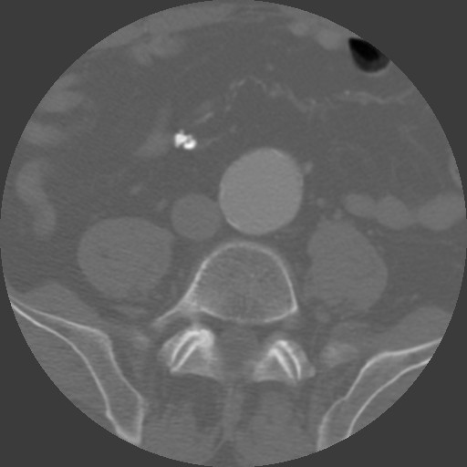
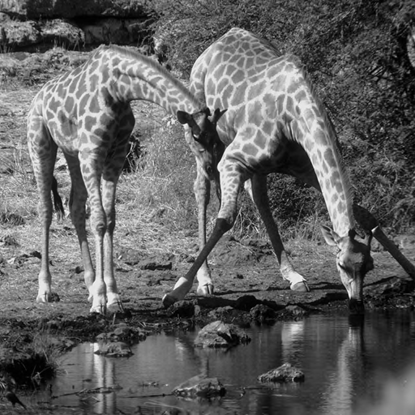
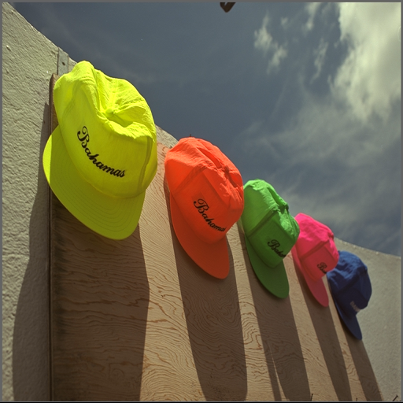

# Compression universelle d'images

Réalisé par Odorico Thibault.

## Images de références

|       Image Médicale $ I_M $       |      Image de Girafes $ I_G $      |              Image de Casquettes $ I_C $               |
| :--------------------------------: | :--------------------------------: | :----------------------------------------------------: |
|  |  |  |

# Image résultats

|         Compression $ I_M $          |               Compression $ I_G $                |                  Compression $ I_C $                   |
| :----------------------------------: | :----------------------------------------------: | :----------------------------------------------------: |
|  |  |  |
|         **Taille originale**         |               **Taille originale**               |                  **Taille originale**                  |
|            262144 octets             |                  262144 octets                   |                     786432 octets                      |
|        **Taille compressée**         |              **Taille compressée**               |                 **Taille compressée**                  |
|             65536 octets             |                   65536 octets                   |                     196608 octets                      |
|       **Taux de compression**        |             **Taux de compression**              |                **Taux de compression**                 |
|                  4                   |                        4                         |                           4                            |
|               **PSNR**               |                     **PSNR**                     |                        **PSNR**                        |
|               40.8132                |                     25.9476                      |                        31.1263                         |


##  Graph (Taux de compression en Y / PSNR en X)										


## Algorithme

```c++
PGM reduced_by_2(const PGM& img)
{
	PGM reduced(img.width() / 2, img.height() / 2);

	for (size_t i = 0 ; i < reduced.height() ; ++i)
	{
		for (size_t j = 0 ; j < reduced.width() ; ++j)
		{	
			reduced(i, j) = img(i * 2, j * 2);
		}
	}

	return reduced;
}

PGM extended_by_2(const PGM& img)
{
	PGM extended(img.width() * 2, img.height() * 2);

	// Etant le pixel comme un block.

	for (size_t i = 0 ; i < extended.height() ; i++)
		for (size_t j = 0  ; j < extended.width() ; j++)
			extended(i, j) = img(i / 2, j / 2);

	// Moyenne des 4 pixels voisins de img

	for (size_t i = 0 ; i < img.height() ; ++i)
	{
		for (size_t j = 0 ; j < img.width() ; ++j)
		{
			std::array<PGM::value_type, 4> pixels = {
				img(i    , j),
				img(i    , j + 1),
				img(i + 1, j),
				img(i + 1, j + 1),
			};

			double mean = 0;

			for (const auto& pixel : pixels)
				mean += pixel;

			mean /= pixels.size();

			extended((i * 2) + 1, (j * 2) + 1) = round(mean);
		}
	}

	// moyenne des pixels voisins

	for (size_t i = 1 ; i < extended.height() - 1 ; i++)
	{
		for (size_t j = (i % 2 == 0 ? 1 : 2)  ; j < extended.width() - 1 ; j+=2)
		{
			std::array<PGM::value_type, 4> pixels = {
				extended(i - 1, j),
				extended(i    , j + 1),
				extended(i + 1, j),
				extended(i    , j - 1)
			};

			double mean = 0;

			for (const auto& pixel : pixels)
				mean += pixel;

			mean /= pixels.size();
			
			extended(i, j) = round(mean);
		}
	}
	
	return extended;
}
```

