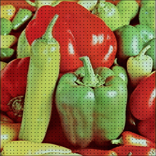
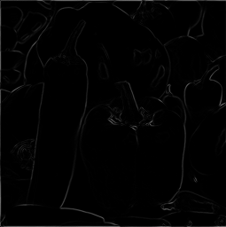
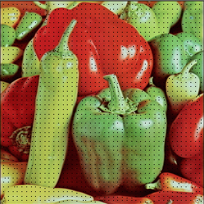
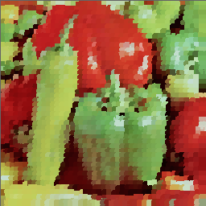
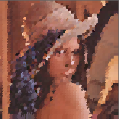
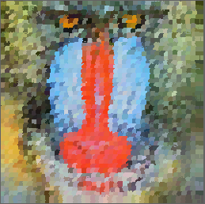

# Super pixels

- Enlève les redondances de l'image
- Permettent de réduire grandement les éléments à traiter
- Pratique pour l'estimation de profondeur dans une image
- Pratique pour la segmentation d'image
- Pratique pour la localisation d'objets

**Remarque** : pour être utiles ils doivent fournir un segmentation de qualité et être rapide à l'execution (surtout si on veut les utiliser pour de la vision par ordinateur)

| Methode                     | Graphe      | Graphe           | Graphe          | Gradient    | Gradient | Gradient | Gradient | Gradient |
| --------------------------- | ----------- | ---------------- | --------------- | ----------- | -------- | -------- | -------- | -------- |
| **Algorithme**              | GS04        | NC05             | SL08            | WS91        | MS02     | TP09     | QS09     | SLIC     |
| **Ctrl nb de super pixels** | Non         | Oui              | Oui             | Non         | Non      | Oui      | Non      | Oui      |
| **Ctrl Compacité**          | Non         | Oui              | Oui             | Non         | Non      | Oui      | Non      | Oui      |
| **Complexité O(.)**         | $$N.log.N$$ | $$ N^{3\over2}$$ | $$ N^2.log.N $$ | $$N.log.N$$ | $$N^2$$  | N        | $$dN^2$$ | N        |
| **Paramètres**              | 2           | 1                | 3               | 1           | 3        | 1        | 2        | 1        |

## Méthode par graphe

- Pixels $\rightarrow$ nœud du graphe
- Arêtes $\rightarrow$ pondérées proportionnellement à la similarité entre les pixels
- Segments $\rightarrow$ extraits en minimisant une fonction de coût sur le graphe

## Méthode par gradient

- On part ensemble de super-pixels uniformes
- On améliore les super-pixels de manière itératives

## SLIC : Simple Linear Iterative Clustering

- Significativement plus efficace en segmentation et en temps d’exécution que les autres algorithmes
- Rassemblement des pixels en 5D (l, a, b, x, y)
- Garantie la similarité de couleur et la proximité des pixels
- (l, a, b) Couleur CIELAB $\rightarrow$ Plus conforme à la perception des écarts de couleur par les humain (même pour des petites distances)
- (x, y) Position $\rightarrow$ Normalisé pour ne pas donner trop d'importance aux grande distances

### Mesure de distances

- Pour $K$ super pixels sur une image de $N$ pixels on à $N \over K$ pixels par super pixels
- On place un centre sur chaque intervalle de grille $S = \sqrt{N \over K}$
- L'espace de recherche pour les pixels d'un super pixels est dans la zone $2S \times 2S$ autour du centre
- $d_{lab} = \sqrt{(l_k - l_i)^2 + (a_k - a_i)^2 + (b_k - b_i)^2}$
- $d_{xy} = \sqrt{(x_k - x_i)^2 + (y_k - y_i)^2}$
- $Ds = d_{lab} + \frac{m}{S}d_{xy} $
- On peut contrôler la compacité des super pixels avec la variable $m \in [1,20]$
- Plus $m$ est grand plus les supers pixels seront compacts

## Algorithmes

1. Initialize cluster centers $C_k = [l_k, a_k, b_k, x_k, y_k]^T$ by sampling pixels at regular grid steps $S$.

   

2. Perturb cluster centers in an $n \times n$ neighborhood, to the lowest gradient position.

   | Gradient                                                     | Super pixels                                                 |
   | ------------------------------------------------------------ | ------------------------------------------------------------ |
   |  |  |

   

3. **repeat**

4. ​    **foreach** cluster center $C_k$ **do**

5. ​        Assign the best matching pixels from a $2S \times 2S$ square neighborhood  

   ​        around the cluster center according to the distance measure.

6. ​    **end for**

7. ​    Compute new cluster centers and residual error $E$

   ​    {$L1$ distance between previous centers and recomputed centers}

8. **until** $E \leq $ threshold

   

9. Enforce connectivity.

## Code source

```c++
void SLIC(PPM& image, size_t K, double M = 10, size_t iterations = 5)
{
	double N = image.size(); // nb pixels
	double S = sqrt(double(N) / double(K)); // interval between super pixels centers

	size_t k = 0;
	std::vector<SuperPixel> super_pixels;
	super_pixels.reserve(K);

	// Placement des centre de super pixels sur une grille uniforme

	for (size_t i = 1 ; i < ((image.height()) / S); i++)
	{
		for (size_t j = 1 ; j < ((image.width()) / S); j++)
		{
			size_t y = (i) * S;
			size_t x = (j) * S;
			super_pixels.push_back({ image(y, x), {y, x}, {} });
			k++;
		}
	}

	// deplacement des supers pixels sur les gradient les d'intensité min
	
	PGM image_gradient = gradient(image);

	for (auto& px : super_pixels)
	{
		px.xy = min_one_of_neighbors(image_gradient, px.xy);
	}

	
	for (size_t i = 0 ; i < iterations ; ++i)
	{
		assign_pixels_to_super_pixels(image, super_pixels, S, M);
		update_super_pixels_center(image, super_pixels);
	}
	
	draw_super_pixels_color(image, super_pixels);
}
```

## Résultats

| peppers                                                      | lena                                                         | baboon                                                       |
| ------------------------------------------------------------ | ------------------------------------------------------------ | ------------------------------------------------------------ |
|  |  |  |


## Execution du programme

```bash
./bin/super_pixels image_entree.ppm > image_sortie.ppm
```


