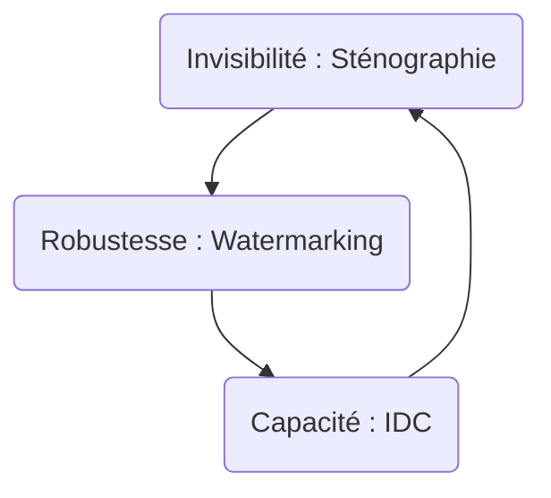

# HMIN322 - Codage et compression multimedia

## Sommaire

[TOC]

## Informations

### Examens

- **Note finale** : 33% CC + 66% Exam

### Ressources

- [Cours et TDs-TPs](https://www.lirmm.fr/~wpuech/enseignement/master_informatique/Compression_Insertion/)

## Sécurisation des données

- **Compression** : suppression des en réduisant la taille de l'image

- **Chiffrement** : suppression des redondances sans réduire la taille de l'image

**Remarque** : on ne peut pas chiffrer une image puis la compresser (plus de redondances). Les algorithmes utilisé sont donc des hybridations d'algorithmes de compression et de chiffrement.

## Insertion de données cachées

- Invisible
- Résiste aux transformations
- Contrainte sur la longueur maximum du message
- Résiste aux attaques
- Applicable dans des applications en temps réel

### Hachage

- Chiffrement de n'importe qu'elle données en une petite signature de taille fixe
- À la moindre différence entre les deux donnée la signature deviens totalement différente

### Caractéristiques d'une image

- Forme

- Texture
- Couleurs

# TP1

transformer image en palette