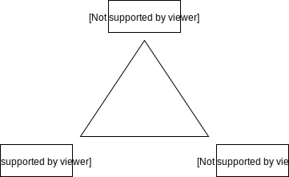

# HMIN322 - Codage et compression multimedia

## Table des matières

[TOC]

## Informations

### Examens

- **Note finale** : 33% CC + 66% Exam

### Ressources

- [Cours et TDs-TPs](https://www.lirmm.fr/~wpuech/enseignement/master_informatique/Compression_Insertion/)

## Sécurisation des données

- **Compression** : suppression des redondances en réduisant la taille de l'image

- **Chiffrement** : suppression des redondances sans réduire la taille de l'image

**Remarque** : on ne peut pas chiffrer une image puis la compresser (plus de redondances). Les algorithmes utilisé sont donc des hybridations d'algorithmes de compression et de chiffrement.

## Insertion de données cachées

- Invisible
- Résiste aux transformations
- Contrainte sur la longueur maximum du message
- Résiste aux attaques
- Applicable dans des applications en temps réel 




## Hachage

- Chiffrement de n'importe quelle donnée en une petite signature de taille fixe
- À la moindre différence entre les deux donnée la signature deviens totalement différente

### Caractéristiques d'une image

- Forme

- Texture
- Couleurs

- **Symmetric encryption by block** : DES, TEA, AES laisse des traces de l'ancienne image

## Format des images et colorimétrie

Grande diversité d'image  difficulté à créer un compresseur efficace universel

### Codage source

- Compression
- Chiffrement
- Insertion de données cachées

### Format d'un fichier image

- **Header**
  - Code : Magic number
  - Format d'image en pixel : L x H
  - Taille d'un pixel : 1 bit (binaire), 8 bits (monochrome), 24 bits (3 x 8 bits : vraies couleurs)

- **Données images**
  - Données des pixels
  - Ordre de lecture des pixels
  - Structures complexes

- **Footer**
  - Informations supplémentaires de l'image

**Exemple** : Header pour le format PNM (Portable Any Map) 

```
P5
512 512
255
# Commentaires
```

## Compression sans perte

- **TGA** : Algorithme RLE
- **GIF** :  Algorithme LZW
- **PNG** : Algorithme LZ77
- **TIFF** : Algorithme RLE + Codage prédictif
- **JPEG** : Compression sans perte possible : Codage prédictif
- **JPEG2000** : JPEGLS


## TP1 - Palette

réduction des couleurs d'une image en une palette de couleurs pertinente


## TP2 - Espace couleur

Image RGB au format N x M  3 x M x N pixels

en sortie on veux 1.5 x M x N pixels (Taux de compression à deux)

ré-échantillonnage en prenant seulement 2 composantes


**1) Image compressé :**

 avec ré-échantillonnage


 avec ré-échantillonnage


**2) RGB  YCrCb :**

Même chose en sacrifiant Cr et Cb

**Conclusion** : cette compression marche mieux en YcrCb qu'en RGB


## Théorie de l'information

## Compression sans perte

## Compression avec perte

