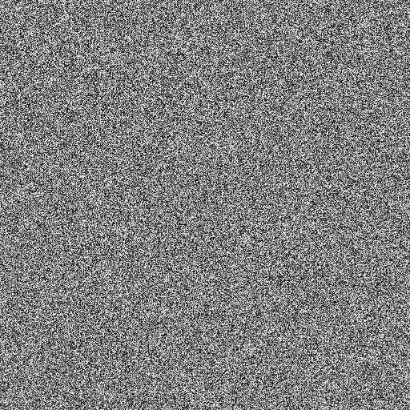
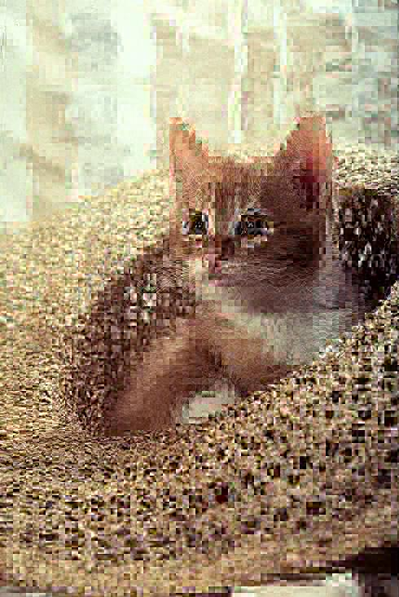
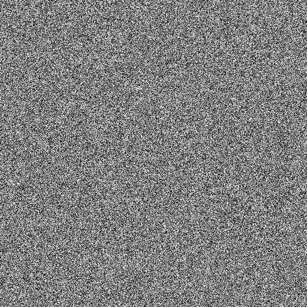
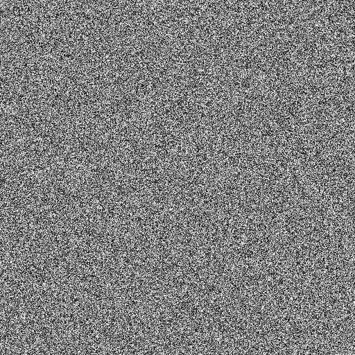

# HMIN322 : TP1 - Chiffrement

Ce TP à été réalisé par Odorico Thibault.

## Tables des matières

[TOC]

## Chiffrement d'images avec l'AES

### Image de référence pour le chiffrement CBC


### Image chiffrée en AES-CBC

| Clef de chiffrement | 2B28AB097EAEF7CF15D2154F16A6883C               | 2B28AB097EAEF7CF15D2154F16A6883D               |
| ------------------- | ---------------------------------------------- | ---------------------------------------------- |
| **Images**          |  |  |
|                     | $ I_{e1} $                                     | $ I_{e2} $                                     |

```bash
$ diff casimir_e_1.pnm casimir_e_2.pnm
"Les fichiers binaires casimir_e_1.pnm et casimir_e_2.pnm sont différents"
```

Deux clefs de chiffrement différentes donne bien deux images chiffrées différentes.

### Image de référence pour le déchiffrement


### Déchiffrement de l'image 

En essayant plusieurs mode de déchiffrement on se rend compte que l'image est déchiffrable en AES-OFB en utilisant la clef : 0123ABC4567DEF890123ABC4567DEF89


### Fonctionnement des différents modes

Pour le chiffrement les données sont découpées en bloc puis chiffrer selon différents modes.

- **ECB** : Chaque bloc sera chiffré à l'aide de la même clef de chiffrement

- **CBC** : On fait une opération XOR avec le premier bloc et un vecteur d'initialisation puis on chiffre ce bloc modifié. On se sert ensuite de ce bloc chiffré comme vecteur d'initialisation pour chiffré le bloc suivant et ainsi de suite.
- **OFB** : On chiffre le vecteur d'initialisation à l'aide d'une clé on fait une opération de XOR du vecteur d'initialisation chiffré avec le bloc de donnée puis on se sert du vecteur d'initialisation chiffré comme vecteur d'initialisation pour chiffrer le bloc suivant et ainsi de suite.

**Remarque** : la méthode **ECB** n'est pas sécurité car si on utilise la même clef est utilisé pour chiffré chaque blocs de données, les autre mode utilisent des entrées différentes pour chiffrées chaque blocs.

| Image Originale                          | Image chiffrée en AES-ECB                    |
| ---------------------------------------- | -------------------------------------------- |
|  |  |

On peut clairement voir des traces de l'image originale dans l'image chiffrée en AES-ECB

### Déchiffrement d'une image avec du bruit

| Image chiffrée                             | Image déchiffré                                |
| ------------------------------------------ | ---------------------------------------------- |
|  |  |

## Chiffrement d'images JPEG

### Crypto-Compression en AES-CBC

| Image originale                  | Image chiffrée                           |
| -------------------------------- | ---------------------------------------- |
|  |  |

On constate bien que toutes les composantes n'ont pas été chiffrée, on a obtenu une image relativement similaire à l'originale ayant perdu en qualité.

Cette méthode de chiffrement permet de limité la qualité visuelle de l'image, on peut imaginer qu'une des application pourrais être de faire payer des utilisateurs pour pouvoir accéder à l'image de bonne qualité en leur donnant la clef de chiffrement, sans payer les utilisateurs aurait quand même une idée de la composition de l'image.

## Le chiffrement XOR

### Image de référence


### Résultats du chiffrement

| 1ère application du XOR                      | 2ème application du XOR                      |
| -------------------------------------------- | -------------------------------------------- |
|  |  |

La clef 10 à été utilisé pour chiffré cette image. en relançant l'algorithme de chiffrement avec la même clef on retombe sur l'image originale grâce à la symétrie de l’opération XOR.

## Attaque du chiffrement XOR par brute force

 Comme les clefs possibles pour notre algorithme de chiffrement vont seulement de 0 à 100 il est possible déchiffrer notre image par brute. Pour cela il nous suffira d'appliquer le chiffrement avec toute les clefs possible jusqu’à ce que l'entropie de l'image résultante soit inférieure à un seuil fixé.

## Bonus

### Chiffrement avec différentes clefs

Pour montrer que qu'avec une clef différente notre algorithme donnera un résultat totalement on peut appliquer notre algorithme sur la même image avec 2 clefs différentes

| Chiffrement avec la clef 10                    | Chiffrement avec la clef 11                    |
| ---------------------------------------------- | ---------------------------------------------- |
|  |  |

## Différences entre les deux images chiffrées


En faisant la différences arithmétique entre les deux images chiffrée on se rend bien compte que les différences sont énorme même si les images ont une apparence similaire. les pixels noir représentent les pixels similaires entre les deux images alors que les pixels blanc représentent les pixels ou la différences est maximale.