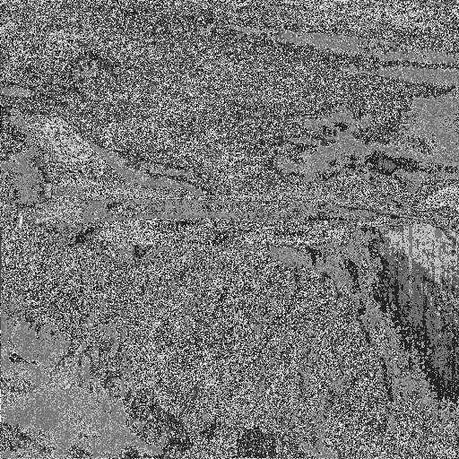

# Compte Rendu TP2 : Chiffrement RSA

Ce TP à été réalisé par Odorico Thibault.

## Tables des matières

[TOC]

## Chiffrement d'images avec RSA

### Image de référence

### Image chiffrée

On à fait une exponentiation modulaire sur chaque pixel avec un exposant $ e = 17 $  et un modulo $ n = 11 \times 23 = 253 $  . la clé publique utilisé est donc le tuple $ (e, n) $

## Déchiffrement d'images avec RSA

Un algorithme pratique pour réaliser le l'inverse modulaire est l'algorithme d’Euclide étendu il nous permet de déchiffré l'image de manière efficace en appliquant l'exponentiation modulaire inverse.

la clé privée utilisé est l'inverse modulaire $ d = 13 $ 