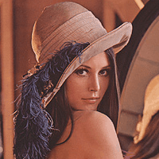

## 	HMIN322 - Compte Rendu du TP1

Ce TP à pour objectif de transformer une image couleur à 16 millions de couleurs (24bits/px) en une image utilisant une palette de couleurs plus réduite (8bits/px) mais toujours représentative de l'image originale. Nous verrons ensemble les différentes étapes qui nous permettrons de produire une telle image (compte rendu réalisé par **Odorico Thibault**).

## Tables des matières

[TOC]

## Image $ 24\:bits/px $ de référence

## Classes de couleurs

Les couleurs ci-dessous seront choisies car elles sont assez éloignées et permettront de séparer les couleurs de l'image en 2 classes.

- $ C1 \rightarrow 30,70,120 $

  
<input style="padding-left:20px;border:none;" type="text" value="" />

<!-- Replace "#FFFFFF" to change the color -->

- $ C2 \rightarrow 200, 130, 100 $

   
<input style="padding-left:20px;border:none;" type="text" value="" />

<!-- Replace "#FFFFFF" to change the color -->

## Algorithme K-mean

$$
Sans\:la\:moyenne
$$

$$
1ère\:passe
$$
## Image $ I_2 $

En faisant plusieurs tests avec plusieurs couleurs de départs (même aléatoire) on remarque qu'il n'est pas nécessaire de faire plus de 10 passes avec l'algorithme k-mean, les classes de couleurs auront forcément converger vers les valeurs RGB suivantes :

- $ C1 \rightarrow 83, 52, 50 $
- $ C2 \rightarrow 175, 113, 93 $

$$
10ème\:passe
$$

## Image $ I_{256} $

En appliquant le même algorithme avec 256 classes de couleurs choisies aléatoirement dans l'image on obtient l'image suivante:

$$
10ème\:passe
$$
En comparant cette Image $ I_{256} $ avec l'image de référence on trouve un PSNR de 39dB et $ 20 < PSNR < 50 $  nous indique que notre image est de bonne qualité par rapport à l'originale

## Image $ 8\:bits/px$ finale

En attribuant à chaque pixel de l'image l'index de la couleur la plus proche dans la palette on obtient l'image suivante codée sur $ 8\:bits/px $ on peut facilement retrouver les informations de couleurs en se servant d'un autre fichier contenant la palette de couleur de l'image.

