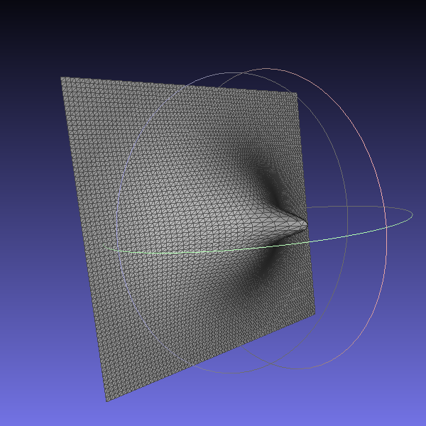
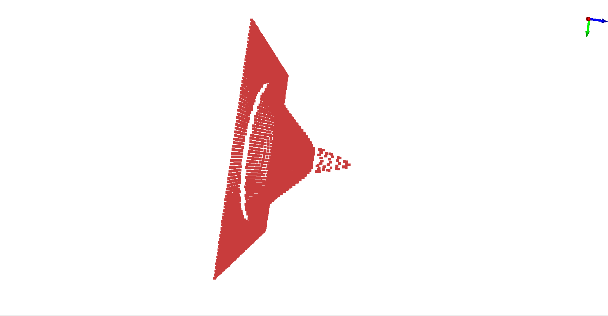
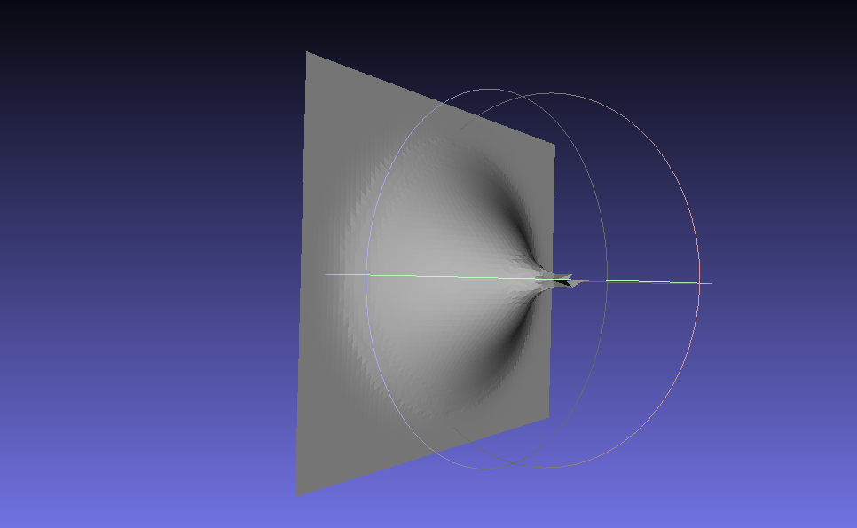

# Compte Rendu N°2 (11 Mars 2020)

## Travail accompli

- Création de maillages avec Blender permettant de tester nos algorithmes.

| $M_{test_0}$                                                 | $M_{test_1}$                                                 | $M_{test_2}$                                                 |
| ------------------------------------------------------------ | ------------------------------------------------------------ | ------------------------------------------------------------ |
|  |  |  |

- Mise en place d'un algorithme de seuillage / filtrage de points entre deux Point_sets.
- Création d'un programme permettant de sélectionner automatiquement les points d’intérêts d'un nombre générique de Point_sets similaires et cela à l'aide d'un seuil pour ensuite pouvoir les indexer dans un "$Super Point Set$" composé uniquement des points différents entre ces Point_sets.

|                       $SuperPointSet$                        |
| :----------------------------------------------------------: |
|  |

- Création d'un programme permettant de reconstruire un Point_set en maillage à l'aide de l'algorithme Scale-Space Reconstruction.

|                $SuperPointSetReconstruction$                 |
| :----------------------------------------------------------: |
|  |

## Travail à faire

- Appliquer le seuillage / filtrage entre deux Maillages plutôt que deux Point_sets
  - Marquer les zones de transition qui sont à la limite d'être seuillées
- Implémenter un algorithme de region-growing avec marquage des sommets sur les régions d’intérêts des deux maillages
- Implémenter un algorithme de triangulation des zones de transition entre deux maillages
- Se documenter sur les méthodes de mesh stitching pour pouvoir interpoler les régions de transitions entre deux maillages
- Implémenter un algorithme d'indexation efficace et cohérent des différences entre plusieurs maillages successifs
- Modifier le visualiseur CGAL (traite un seul maillage et affiche des couleurs aléatoires actuellement) :
	- Prendre en paramètre plusieurs maillages
	- Changer les couleurs des sommets / faces selon nos critères prédéfinies (Valence, Distance, etc...)
	- Ajouter de l'interactivité (sélection de sommets, Déplacement, etc...)
