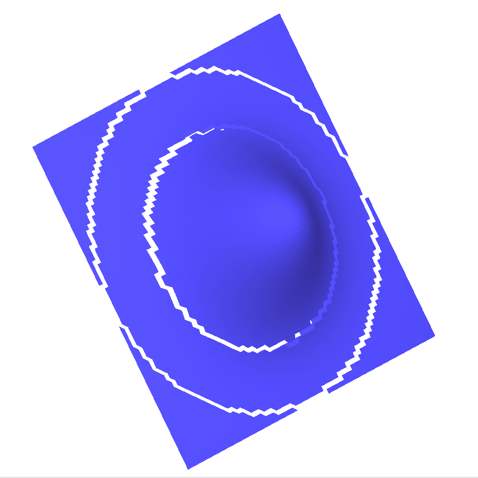
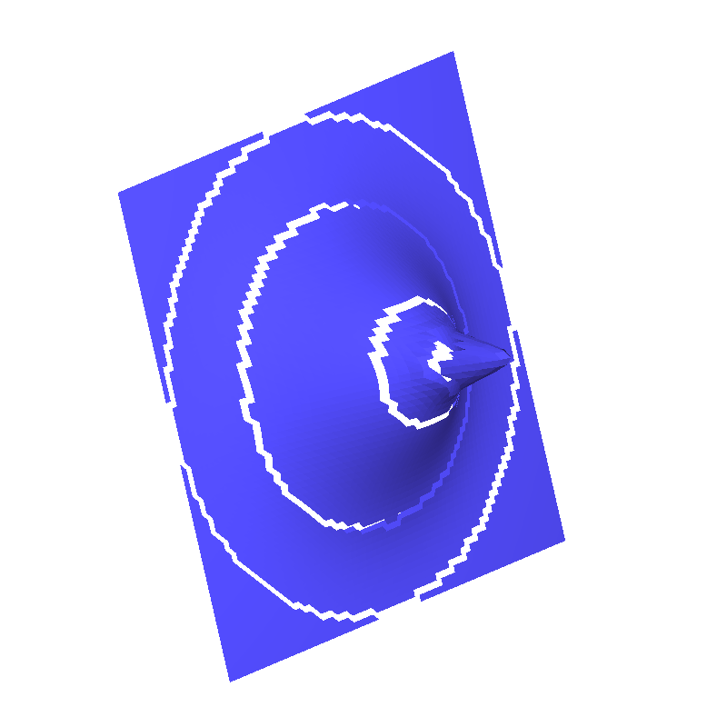

# Compte Rendu N°3 (20 Mars 2020)

## Travail accompli

- Création d'un programme de visualisation de maillage à partir d'un fichier ou d'un flux

```bash
$ ./view
3D viewer for geometrical file formats (OFF, PLY, OBJ).

    Usage: view (<input-file> | --from=<format>)

    Options:
      --from=<format>  Input file <format> expected from stdin.
      -h --help        Show this screen.
      --version        Show version.
```

- Création d'un programme de conversion de formats de fichiers géométriques (PLY, OFF, OBJ) à partir d'un fichier ou d'un flux

```bash
$ ./geoconv
Convert between geometrical file formats (OFF, PLY, OBJ).

    Usage: geoconv <input-file> (<output-file> | --to=<format>)

    Options:
      --to=<format>  Output <format> conversion to stdout.
      -h --help      Show this screen.
      --version      Show version.
```

- Création d'une interface de manipulation de maillage en ligne de commande (applique des fonctions à l’exécution, pratique pour le débogage).
- Création d'un programme de matching des régions divergentes entre plusieurs maillages (avec détection des zones de transition)

```bash
$ ./match
Create a new mesh by matching parts of multiple similars meshes.

    Usage: match <threshold> <input-files>...

    Options:
      -h --help      Show this screen.
      --version      Show version.
```

**Exemples d’exécution :**

|                           $test_0$                           |                           $test_1$                           |                           $test_2$                           |
| :----------------------------------------------------------: | :----------------------------------------------------------: | :----------------------------------------------------------: |
|  |  |  |

|                match 0.08 test0.ply test1.ply                |           match 0.08 test0.ply test1.ply test2.ply           |
| :----------------------------------------------------------: | :----------------------------------------------------------: |
|  |  |

**Remarque :** Les anneaux représentent les zones de transitions entre 2 maillages

## Travail à faire

- **Modifier** le visualiseur CGAL (traite un seul maillage et affiche des couleurs aléatoires actuellement) :
  - Prendre en paramètre plusieurs maillages
  - Changer les couleurs des sommets / faces selon nos critères prédéfinies (Valence, Distance, etc...)
  - Ajouter de l'interactivité (sélection de sommets, Déplacement, etc...)
- **Implémenter** l'algorithme **MLS** pour projeter une zone de transition du maillage M1 sur une zone de transition du maillage M2
- **Implémenter** un algorithme pour **connecter** / **coudre** les bordures de 2 zones différentes
- **Utiliser** l'algorithme de **fairing** sur les points connecté pour un meilleur rendu géométrique
- **Écrire** l'algorithme général de création de notre super maillage