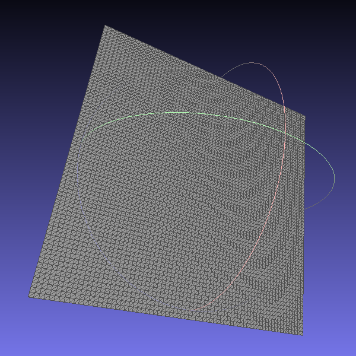
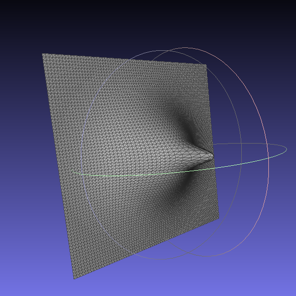

# Compte Rendu N°4 (30 Mars 2020)

## Travail accompli

- Création d'un programme d'affichage des propriétés d'un maillage à partir d'un fichier ou d'un flux

```bash
$ ./prop
List geometrical properties from mesh.

    Usage: prop (<input-file> | --from=<format>)

    Options:
      --from=<format> Input file <format> expected from stdin.
      --list=<E:P>    List specific elements E with property P
      -h --help       Show this screen.
      --version       Show version.
```

**Exemple d’exécution :**

```
$ ./prop test_0.ply
Reading mesh from ../data/mesh/test_0.ply...
Printing mesh properties...
v:connectivity
v:point
v:removed
v:normal
v:s
v:t
e:removed
h:connectivity
f:connectivity
f:removed
```

- Modification du visualiseur pour prendre en compte les couleurs en fonction des propriétés des éléments d'un maillage
- Première mise en forme de l'algorithme de matching

```
Entrée : 2 maillages : M1 et M2
Sortie : Super maillage SM permettant de reformer M1 et M2 en optimisant l'espace mémoire

1. Seuillage des points distants entre M1 et M2 -> Liste de point : M1_LP + M2_LP
2. Séléction des régions à garder -> Régions fixe : M1_RF + M2_RF
3. Détection des régions à reconstruire -> Région transition : M1_RT + M2_RT
4. Projection MLS des régions de transition M1_RT vers M2_RT -> Régions projetées : M1_RP
5. Raboutage des régions M1_RP entre les régions M1_RF et M2_RF -> SM(M1, M2) 

```

- Modification du programme `match` pour visualiser les étapes de transformation entre 2 maillages

**Exemples d’exécution :**

|                           $test_0$                           |                           $test_1$                           |                           $test_2$                           |
| :----------------------------------------------------------: | :----------------------------------------------------------: | :----------------------------------------------------------: |
|  |  |  |

|                match 0.1 test0.ply test1.ply                 |           match 0.1 test0.ply test1.ply test2.ply            |
| :----------------------------------------------------------: | :----------------------------------------------------------: |
|  |  |

**Remarque :**

- Les éléments de la première ligne représentent les maillages initiaux
- Les éléments de la seconde ligne représentent les parties que l'ont vas conserver entre les 2 maillages de la première ligne et ceux précédemment générés
- Les éléments de la troisième ligne représentent les zones de transition que l'ont vas devoir reconstruire / projeter et rabouter pour obtenir un reformation géométrique convaincante

## Travail à faire

- **Implémenter** l'algorithme **MLS** pour projeter une zone de transition du maillage M1 sur une zone de transition du maillage M2
- **Implémenter** un algorithme pour **connecter** / **coudre** les bordures de 2 zones différentes
- **Utiliser** l'algorithme de **fairing** sur les points connecté pour un meilleur rendu géométrique