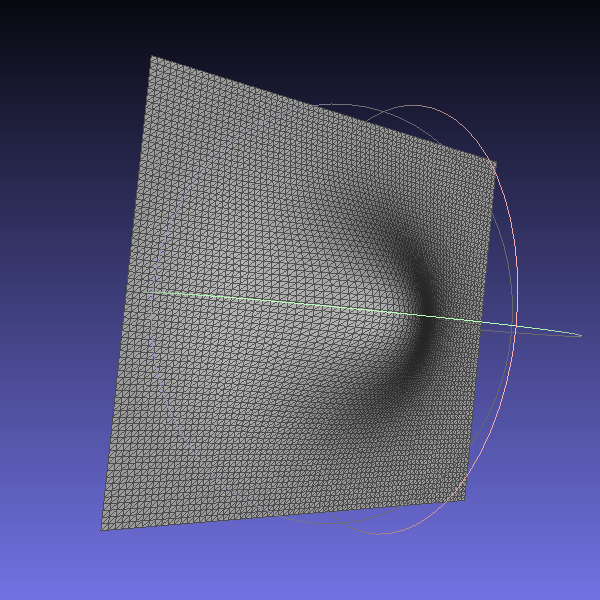

# Compte Rendu N°5 (3 Avril 2020)

## Travail accompli

- Création d'un programme de manipulation de maillage à partir d'un flux.

```bash
$ ./manip
Mesh manipulation utility from geometry file (OFF, PLY, OBJ).

    Usage: manip <input-file> (<output-file> | --to=<format>) [options]

    Options:
      --color=<rgb>        Set mesh color.
      --noisify=<float>    Add random noise to mesh.
      --rotate-x=<float>   Rotate mesh around x axis by an angle in degree.
      --rotate-y=<float>   Rotate mesh around y axis by an angle in degree.
      --rotate-z=<float>   Rotate mesh around z axis by an angle in degree.
      --to=<format>        Output <format> conversion to stdout.
      --translate=<vector> Translate mesh with vector.
      -h --help            Show this screen.
      --version            Show version.
```

- Création d'un programme de projection de maillage (utile pour les zones de transitions entre 2 maillages).

**Exemples d’exécution :**

|                           $test_0$                           |                           $test_1$                           |
| :----------------------------------------------------------: | :----------------------------------------------------------: |
|  |  |

|                match 0.1 test0.ply test1.ply                 |
| :----------------------------------------------------------: |
|  |

**Remarque :**

- Les éléments de la première ligne représentent les maillages initiaux (Soit G et D les maillages en haut à gauche et droite)
- L'élément de la seconde ligne représentent la projection MLS de G sur D avec l'algorithme APSS

## Travail à faire

- **Appliquer** la projection en prenant en compte les parties fixe des maillages initiaux en plus des zones de transition (visualisation)
- **Appliquer** un lissage laplacien à chaque étape de l'algorithme de projection MLS 
- **Associer** à chaque maillage une surface MLS (cela sera pratique pour retrouver les coordonnées de texture plus tard)
- **Implémenter** un algorithme pour **connecter** / **coudre** les bordures de 2 zones différentes
- **Utiliser** l'algorithme de **fairing** sur les points connectés pour un meilleur rendu géométrique